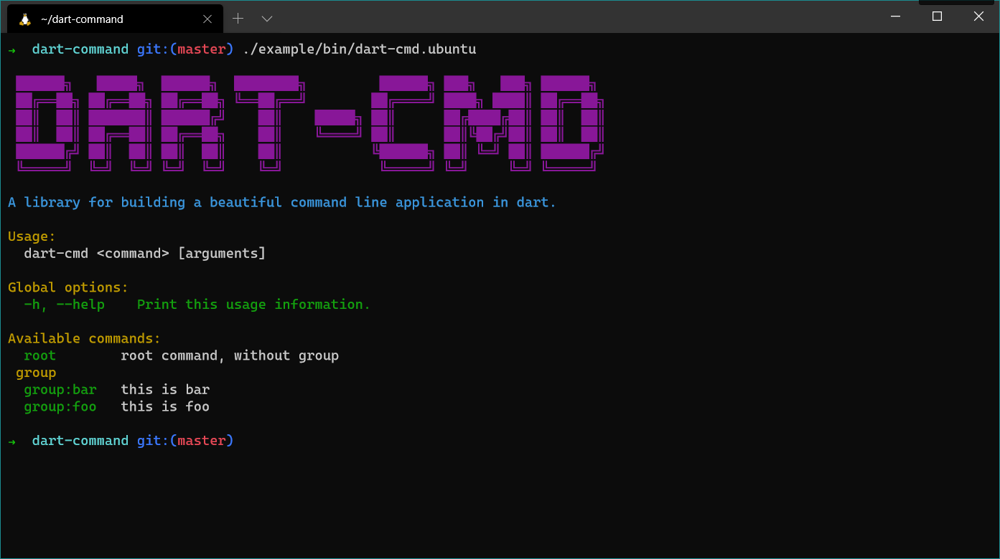
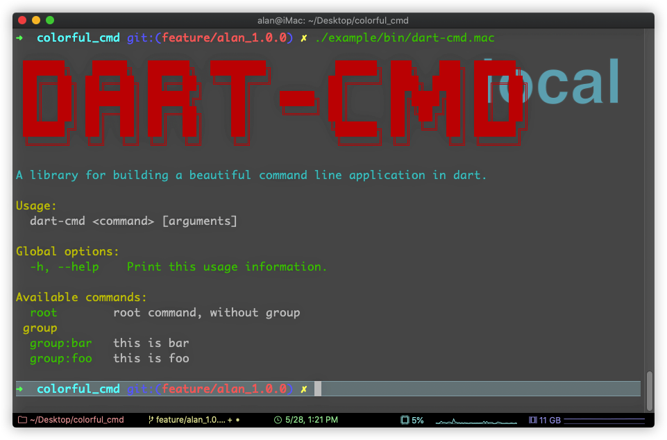
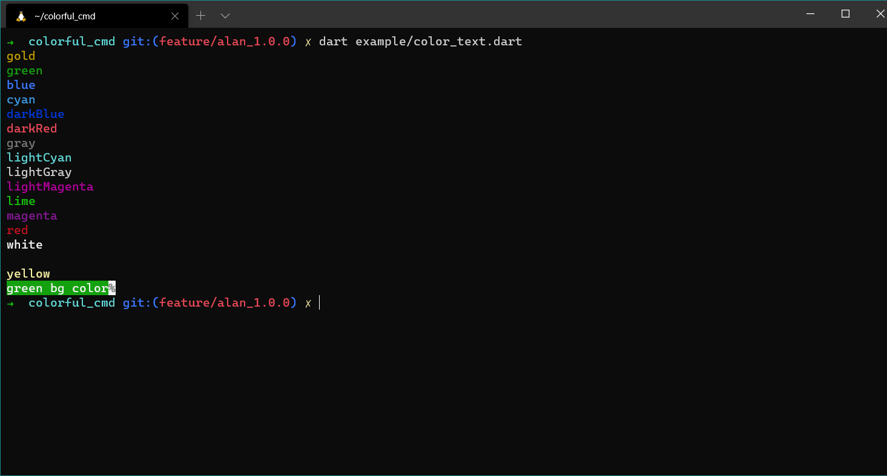
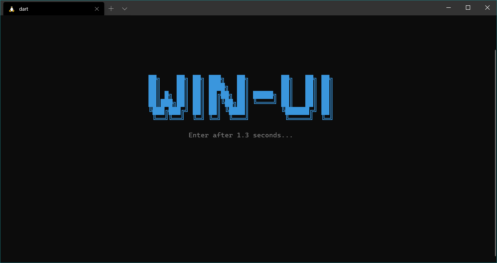

A library for building a beautiful command line application in dart.


## Dependency

* console
* args

## Preview


### Diff OS

* Ubuntu 

* Windows

* Mac


### ColorText



### Command


### RainbowProgress


### WindowUI




## Usage


A simple usage example:

```dart
import 'package:dart_command/command.dart';
import 'package:dart_command/logger.dart';

void main(List<String> args) {
  var kernel = ConsoleKernel();
  kernel.addCommands([RootCommand()])
        .run(args);
}

class RootCommand extends ICmd {

  @override
  String name = 'root';

  @override
  String description = 'root command, without group';

  @override
  List<Flag> get flags => null;

  @override
  List<ILogHandler> get logHandlers => null;

  @override
  List<Option> get options => null;
  
  @override
  void run() {
    warning(description);
    var colorText = ColorText();
    colorText
      .gold('\n\n\ngold\n')
      .green('green\n')
      .blue('blue\n')
      .cyan('cyan\n')
      .darkBlue('darkBlue\n')
      .darkRed('darkRed\n')
      .gray('gray\n')
      .lightCyan('lightCyan\n')
      .lightGray('lightGray\n')
      .lightMagenta('lightMagenta\n')
      .lime('lime\n')
      .magenta('magenta\n')
      .red('red\n')
      .white('white\n')
      .black('black\n')
      .yellow('yellow\n')
      .print();
  }
}
```

**For more examples, see the example folder.**
