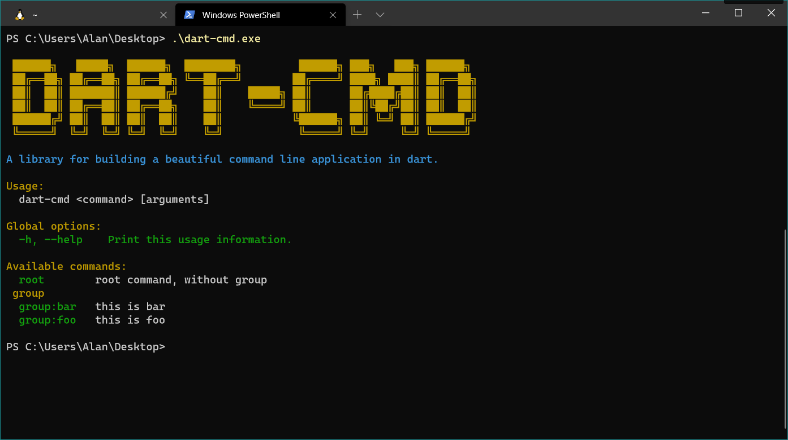

A library for building a beautiful command line application in dart.

## Dependency

* console
* args

## Preview

* ubuntu 

* windows

* mac


## Usage

A simple usage example:

```dart
import 'package:dart_command/command.dart';
import 'package:dart_command/logger.dart';

void main(List<String> args) {
  var kernel = ConsoleKernel();
  kernel.addCommands([RootCommand()])
        .run(args);
}

class RootCommand extends ICmd {

  @override
  String name = 'root';

  @override
  String description = 'root command, without group';

  @override
  List<Flag> get flags => null;

  @override
  List<ILogHandler> get logHandlers => null;

  @override
  List<Option> get options => null;
  
  @override
  void run() {
    warning(description);
    var colorText = ColorText();
    colorText
      ..gold('\n\n\ngold\n')
      ..green('green\n')
      ..blue('blue\n')
      ..cyan('cyan\n')
      ..darkBlue('darkBlue\n')
      ..darkRed('darkRed\n')
      ..gray('gray\n')
      ..lightCyan('lightCyan\n')
      ..lightGray('lightGray\n')
      ..lightMagenta('lightMagenta\n')
      ..lime('lime\n')
      ..magenta('magenta\n')
      ..red('red\n')
      ..white('white\n')
      ..black('black\n')
      ..yellow('yellow\n')
      ..print();
  }
}
```

Other: 

```dart
  Color // color, enum type
  ColorText // colorful text
  Icon 
  KeyCode 
  Keyboard 
  ProgressBar 
  LoadingBar 
  WideLoadingBar 
  Prompter 
  readInput() 
  ShellPrompt
  Chooser 
  Timer 
  createTree() 
  printTree() 
  Window 
  // ...
```
